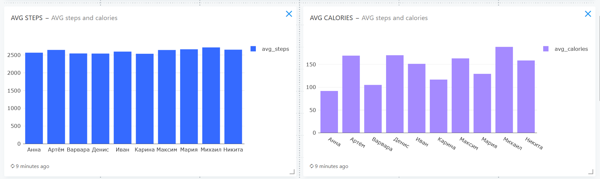
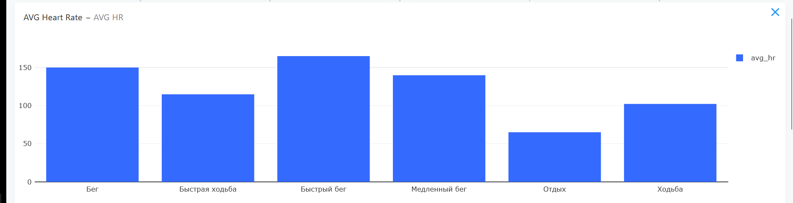
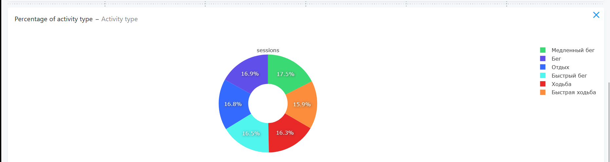
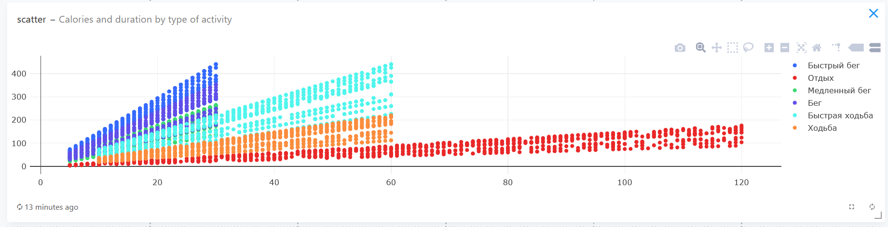
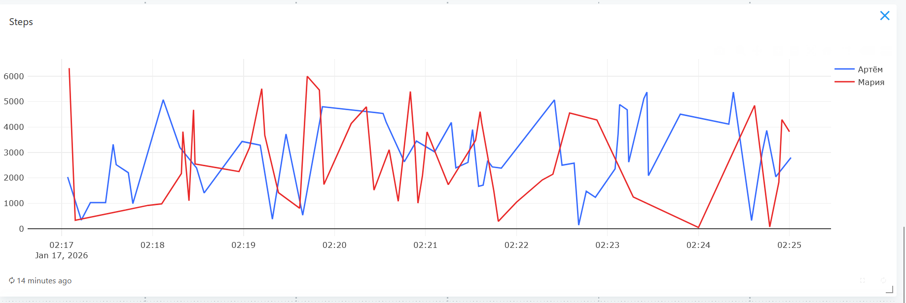
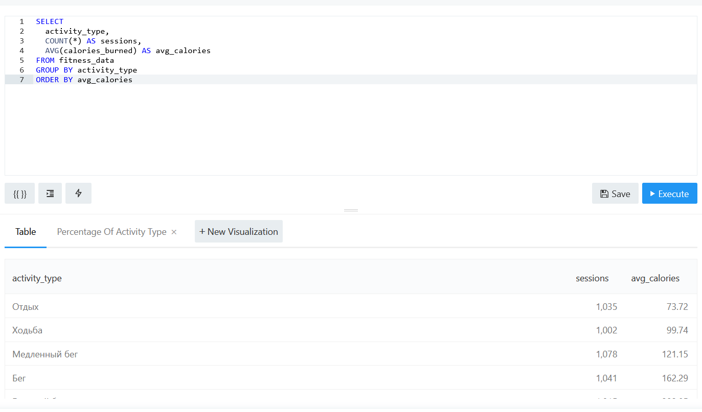

# Фитнес-трекер: система сбора и анализа данных

## Описание проекта
Основной целью проекта являлось создание end-to-end системы для генерации, хранения, анализа и визуализации данных фитнес-трекера в режиме реального времени

## Структура проекта

- **generator/** - разработанный на Python генератор фитнес-данных
- **init-db/** - схема базы данных
- **docker-compose.yml** - развертывание сервисов
- **screenshots/** - скриншоты работы в Redash

## Структура данных
Таблица **fitness_data** содержит следующие поля:
- **id** - уникальный идентификатор записи

- **timestamp** - метка времени создания записи

- **person_id** - ID пользователя

- **person_name** - имя пользователя

- **weight** - вес пользователя

- **gender** - пол пользователя

- **activity_type** - тип активности

- **steps** - количество шагов

- **heart_rate** - частота сердечных сокращений

- **calories_burned** - сожженные калории

- **duration_minutes** - продолжительность активности

## Запуск системы

1. Запуск всех сервисов

```
docker-compose up -d
```

2. Инициализация Redash (необходимо только при первом запуске)

```
docker-compose run --rm redash_server create_db
```

3. Завершение работы системы

```
docker-compose down
```

## Доступ к сервисам
Скрипт **generator.py** запускается и записывает данные в базу автоматически после запуска системы.

Для доступа к Redash нужно открыть **http://localhost:5000**

Для просмотра базы данных PostgreSQL в терминале необходимо ввести
```
docker exec postgresProject -u projectuser -d projectdb -c 'SELECT * FROM fitness_data'
```

## Добавление источника данных в Redash
После перехода на **http://localhost:5000** необходимо добавить источник данных. Настройки подключения следующие:

- **Name**: любое удобное
- **Host**: postgresProject
- **Port**: 5432
- **User**: projectuser
- **Password**: 12345project
- **Database Name**: projectdb

## Скриншоты работы в Redash
Скриншоты работы с дашбордом также продублированы в папке **screenshots**
### Созданный дашборд

### Содержимое дашборда
#### Топ 5 пользователей по шагам

#### Средний пульс и среднее количество сожённых калорий для каждого пользователя

#### Средняя частота ЧСС по каждому виду активности

#### Доля каждой активности

#### Зависимость между сожёнными калориями и временем активности 

#### Количество шагов по записям для нескольких пользователей 

#### Пример запроса в Redash

